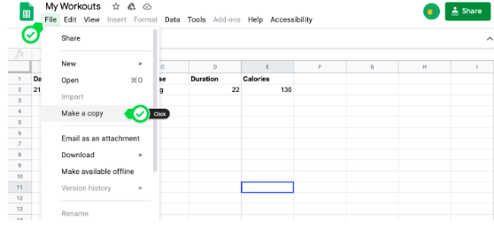

# Exercise Tracking App

## Overview
This Python application allows you to track your daily exercises and store the data in a Google Sheet. The app uses the Nutritionix API to get data of exercise and Sheety API to interact with the spreadsheet.

## Setup
1. Clone this repository to your local machine:

    ```bash
    git clone https://github.com/your-username/exercise-tracking-app.git
    cd workour-tracking
    ```

## Setup API Credentials and Google Spreadsheet:

1. Go to [this link](https://developers.google.com/sheets/api/quickstart](https://docs.google.com/spreadsheets/d/1C6LMIG-6By3ET7_JSKs7ml5C7DiZ1sf0I10n7OAKBpM/edit?usp=sharing)https://docs.google.com/spreadsheets/d/1C6LMIG-6By3ET7_JSKs7ml5C7DiZ1sf0I10n7OAKBpM/edit?usp=sharing) and create a copy of the My Workouts Spreadsheet. You may need to login/register.
     

2. Go to the [Nutritionix API](https://www.nutritionix.com/business/api) website and select "Get Your API Key" to sign up for a free account. Double check your spam folder (and/or your gmail "promotions" tab) for the Nutritionix verification email.
3. Once logged in, you should be able to access your API key and App id.
4. Create a new project in PyCharm and in the main.py create 2 constants to store the APP_ID and API_KEY that you got from Nutritionix.

## Setup Your Google Sheet with Sheety

1. Log into [Sheety](https://sheety.co/) with your Google Account. 

Make sure you give Sheety permission to access your Google sheets. If you miss this step, log out of Sheety and log in again. Make sure the email matches between your Google Sheet and Sheety Account.
Under your Google Account Security settings, you should see that Sheety has access. Double-check that you see Sheety listed as an authorized app. Otherwise, your Python code can't access your spreadsheet.

2. In your project page, click on "New Project" and create a new project in Sheety with the name "Workout Tracking" and paste in the URL of your own "My Workouts" Google Sheet.
3. Click on the workouts API endpoint and enable GET and POST.

## Usage
1. Run the app:

    ```bash
    python main.py
    ```

